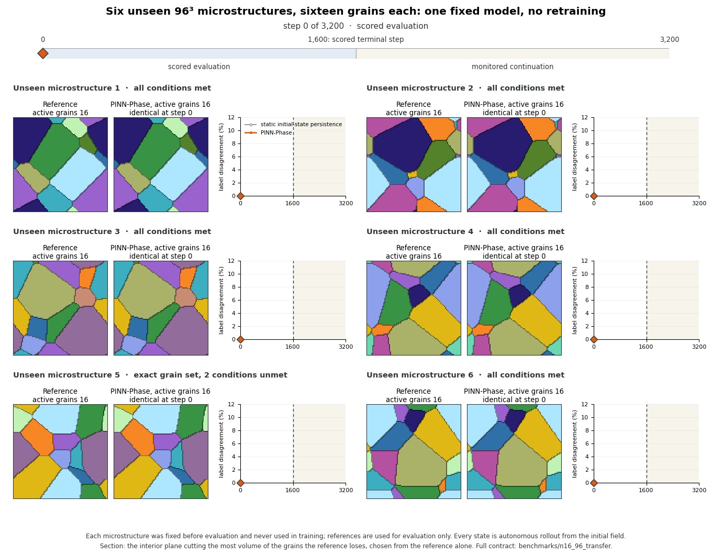
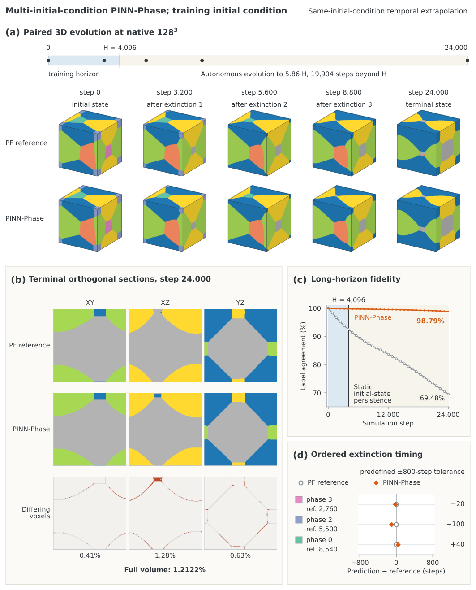

# PINN-Phase

**Physics-informed neural time integrators for curvature-driven phase-field
evolution.**

PINN-Phase advances an initial phase field one admissible neural step at a time,
capturing growth, shrinkage, extinction, and topology change in two- and
three-dimensional designed benchmarks. The two-dimensional evaluations extend
to 12,000 autonomous steps, and the native 128³ evaluations to 24,000 steps,
5.86 times the represented training horizon. For the reported explicit-MPF models, the physical
training target is evaluated on the model's own evolving field; post-initial
reference states are reserved for evaluation rather than used as step targets.

The benchmarks below form a **progressive ladder**, in the order the study was
built: a single scalar interface, then multiphase relaxation and 2D coarsening,
then a dense 64-grain field, then a prospectively fixed test on microstructures
the model has never seen, and finally three dimensions, up to native 128³
evolution with transfer to blind initial conditions. Each rung adds one kind
of difficulty — a dimension, a phase count, a topology event, or an unseen
initial condition.

The repository includes scalar and explicit multiphase-field benchmarks,
first-generation and permutation-equivariant model families, hash-first artifact
loading, and a prospectively fixed transfer study whose complete score can be
recomputed from 2.6 MB of shipped data.

**New to the model?** Start with the eight-part
[physics-first tutorial series](docs/tutorials/README.md), from diffuse-interface
foundations and the explicit MPF operator through training, symmetry,
long-horizon topology, and replay. [`docs/README.md`](docs/README.md) maps the
rest of the scientific and reproducibility documentation.

## Related Paper

**PINN-Phase: A physics-informed neural network for curvature-driven multiphase-field evolution**

S. Elfetni, P. H. Seeberger, T. Tyrikos-Ergas
[arXiv:2608.29413](https://arxiv.org/abs/2608.29413) ·
[DOI: 10.48550/arXiv.2608.29413](https://doi.org/10.48550/arXiv.2608.29413)

## Rollout, temporal extrapolation, and generalisation

PINN-Phase is evaluated along two independent axes: **time** and **initial
condition**.

```text
Development initial condition phi_0(dev)
        |
        | physics-residual training on the model's own rollout
        | represented rollout horizon H
        v
  frozen checkpoint
        |
        +-- development IC: autonomous rollout  0 -------- H -------- T
        |                                      represented   extrapolation
        |
        +-- unseen IC phi_0(k), k = 1,...,m
              same frozen weights, no retraining or adaptation
              direct autonomous rollout, evaluated within or beyond H
```

- **Autonomous rollout** repeatedly feeds each predicted state into the next
  model step.
- **Temporal extrapolation** continues that rollout beyond the represented
  training horizon `H`.
- **Initial-condition generalisation** applies the same frozen model directly
  to an unseen initial condition.

An unseen-case evaluation may stay within `H`, or it may test generalisation
and temporal extrapolation together.

---

## How PINN-Phase advances a phase field

<p align="center">
  
</p>

Each update advances `phi(t) -> phi(t+dt)` and feeds the result back as the next
input:

- **Two views of the field.** A pointwise branch produces a site-local
  response; a convolutional recurrent branch produces a spatially coherent
  response.
- **A learned blend.** A learned coefficient blends the two branch responses
  into a single response.
- **A bounded, zero-sum increment.** In the accepted, currently-distributed
  configurations the blended response is squashed, scaled, and phase-centered
  into a bounded increment that sums to zero across phases; the model class
  also permits an older, unbounded parameterization that no shipped checkpoint
  uses (see
  [`docs/tutorials/04_one_pinn_phase_step.md`](docs/tutorials/04_one_pinn_phase_step.md)).
- **An explicit update step.** The increment advances the field — this step
  does not evaluate the physical multiphase-field operator, which supplies the
  training target
  only ([`docs/tutorials/05_physics_informed_training.md`](docs/tutorials/05_physics_informed_training.md)).
- **A valid microstructure.** An admissibility map keeps the field
  physical (`phi` in `[0,1]`, `sum(phi) = 1`) across a long rollout.

The animation shows the **first-generation hybrid model**, the family behind the
junction and the three-dimensional cubes, in its hard clip-and-renormalize
configuration. The **permutation-equivariant model** used for the 25-grain and
64-grain results keeps this autonomous, physics-guided loop but replaces the
per-phase branches with a shared encoder and symmetric aggregation, so
relabelling the phases relabels the output channels accordingly without
changing the physical prediction. It
carries 9,605 parameters. Full method:
[`docs/METHOD_OVERVIEW.md`](docs/METHOD_OVERVIEW.md).

---


## Scalar interface motion and topology change

The first rung drops phase identities entirely and asks whether a single interface
can be moved correctly, and then let a domain vanish. Note that this rung exercises
the **reference solver**, not a trained model: the 0.997% below is the solver's
fidelity against the analytic radius-squared law, and it is the one number on this
page you can regenerate end to end from the repository.

<p align="center">
  
</p>

A circular grain shrinks under curvature flow, and its area falls linearly in
time — the radius-squared law. This case ships complete and regenerates locally
in seconds:

```bash
python scripts/reproduce_scalar_reference.py
```

The reproduction recovers the pre-extinction radius-squared slope to **0.997%**
relative error, with monotone sampled energy.

**Many-grain shrinkage cascade** — a 44-grain field coarsening to a single domain
across 41 saved frames.

<p align="center">
  
</p>

Given only the initial field, the model reproduces the whole coarsening cascade
down to one domain on a periodic domain, matching the reference's thresholded
component count at every saved frame, with differences staying small and
interface-localized. Component counts describe the topology of a thresholded
field; they are not persistent grain labels.

---

## Multiphase relaxation and two-dimensional coarsening

The second rung restores explicit phase identities, so grains can now be tracked,
mistaken for one another, or lost.

**Four-phase junction relaxation** — a four-phase field relaxed to step 6,000.

<p align="center">
  
</p>

Equilibrium junction angles are a standard multiphase-field benchmark. Starting
from a right-angle configuration, the model relaxes toward the equal-energy
geometry and holds it: terminal label disagreement is **3.27%** against a 6.54%
persistence baseline, all four phases stay active, and the junction angles reach
127.8°, 115.9°, and 116.4° — an RMS deviation of 5.5° from 120°.

### The 25-grain cascade

The permutation-equivariant model was trained on one 25-grain initial condition
with a 4,096-step horizon and then run autonomously on it for 12,000 steps; the
final 7,904 steps lie beyond the horizon it was trained with.

<p align="center">
  
</p>

The diagnostic panel beneath the fields is divided at step **4,096**, the
horizon the model was trained with, and labels both sides in the figure itself:
everything left of the mark is **within the represented training horizon**, and
the **7,904 steps** to its right are **autonomous extrapolation** beyond it — the
same division the 64-grain animation below draws at its own horizon of 8,192.
The whole rollout is autonomous, and the mark describes only the rollout's
relation to training: "within the represented horizon" does not mean the model
was shown these states, and training used no reference frames after step 0. The
phase-field reference is drawn complete as a held-out comparator used for
evaluation only; only the rollout advances.

Twenty-five grains coarsen to sixteen. The model ends **1.46%** of pixels away
from the reference, against a persistence floor of **44.37%**, and recovers the
**exact 16-grain terminal survivor set** — no grain lost that should have
survived, none kept that should have died. At step 4,000 the figures are
**0.81%** against a **26.59%** floor.

The same frozen weights, with no retraining or tuning, were then run on a
*different* development initial condition: **0.95%** at step 4,000 against a
**28.97%** floor, **1.13%** at step 12,000 against **51.25%**, the exact 12-grain
terminal set, and all 13 reference extinctions reproduced.

**Both cases are development evidence.** The model was trained on the first and
the second was chosen from the same development suite, so neither is a
prospectively fixed test — that comes further down the ladder. The active-grain
count tracks the reference at every audited cadence step but one in each case.

**The disclosed failure.** The pre-registered timing anchor does **not** pass.
Extinction events are systematically **premature**: the model tends to remove a
grain before the reference does, with median residuals of −53 steps on the
training case and −85 on the second. Terminal survivor sets are exact; the timing
of getting there is not.

---

## Dense 64-grain coarsening

The largest phase-count, long-horizon two-dimensional benchmark on the ladder.

**The registered primary result.** The model was trained with a 4,096-step
horizon, frozen, and evaluated once against criteria fixed beforehand. Rolling
autonomously from one 128², 64-grain initial condition, it reaches **1.35%**,
**3.50%**, and **6.09%** differing pixels at steps 4,000, 8,000, and 12,000. The
persistence floor at step 12,000 is **69.89%**. The reference retains 21 grains;
the prediction retains those same 21 plus one additional grain, giving a terminal
survivor F1 of **0.9767** with **no false deaths and no reappearances**: all 21
true survivors are retained, and the single discrepancy is one additional
retained grain.

**A post-evaluation sensitivity run.** After the registered primary evaluation,
training was continued for 25 additional epochs with the represented horizon
extended from 4,096 to 8,192 steps. The resulting checkpoint was then rolled
autonomously to step 12,000. The final 3,808 steps therefore test extrapolation
beyond its represented training horizon; no post-t0 reference states were used
for training.

<p align="center">
  
</p>

The diagnostic panel beneath the fields is divided at step **8,192** and labels
both sides in the figure itself: everything left of the mark is **within the
represented training horizon**, and the **3,808 steps** to its right are
**autonomous extrapolation** beyond it. The whole rollout is autonomous — the
label distinguishes the horizon represented during training from the interval
past it, not a supervised stretch from an unsupervised one.

The boundary describes the rollout's relation to training and nothing else: there
is no restart and no physical discontinuity there, and nothing about the field
panels changes as it is crossed. The phase-field reference is the fixed backdrop
of the panel: it is drawn complete, does not move, and spans the boundary as a
**held-out comparator used for evaluation only** — it was never supplied to the
model, inside the represented horizon or outside it. Only the rollout advances,
so what travels across the panel is the model's own trajectory and its
disagreement with that comparator.

The run reaches **0.85%**, **2.07%**, and **3.97%** at the same three milestones,
recovers the **exact 21-grain terminal survivor set**, and matches **43 of 43**
reference extinctions by identity.

Read that second run for what it is. It is a **sensitivity study of one design
choice, carried out after the evaluation had finished** — not an independent
confirmation, and not the registered result. The horizon and the additional
training effort co-vary, so the improvement cannot be attributed to the horizon
alone. The registered primary outcome above is the one that was scored once
against criteria fixed in advance.

Both are **one initial condition and one seed**. The large fields are not
distributed in v0.1; their SHA-256 identities, and those of the arrays behind the
animation, are recorded in
[`docs/COMPLETED_EVIDENCE_LEDGER.md`](docs/COMPLETED_EVIDENCE_LEDGER.md).

---

## Prospective generalization to unseen initial conditions

Every rung so far is a development benchmark: the model was trained on that
initial condition, or the case was drawn from the same development suite. They
measure fidelity on development initial conditions. Whether the frozen model
transfers to unseen initial conditions is a separate question, answered by an
evaluation fixed before the result is known.

The primary model was trained from **a single initial condition**, frozen, and
run autonomously for 12,000 steps on **ten microstructures it had never seen** —
eight drawn from the same generator as training, plus two deliberately harder
*stress cases* with denser and sparser grain structures. Criteria and the cohort
bar were fixed in advance, and there was **one scoring pass**. It passed every criterion
on **7 of the 8 unseen cases and both harder cases**. A secondary model trained
from six initial conditions reached the same counts; it corroborates the primary
and can neither rescue nor veto it.

<p align="center">
  
</p>

A representative unseen case: twenty-five grains coarsen to thirteen, the model
reaches the same thirteen, and it ends with **1.38% of pixels differing** from a
reference it never saw. The discrepancy panel is empty at step 0 by construction
— that frame is the shared initial condition — and the differences that follow
stay localized on the grain boundaries.

<p align="center">
  
</p>

All ten cases at step 12,000. Across the seven passing unseen cases, terminal
differences run from **0.97% to 1.85%** of pixels, against persistence baselines
of 32% to 49%; both harder cases pass, at 0.94% and 2.15%. Every case is
structurally valid, no case shows a grain reappearing after disappearing, and
every case places its differing pixels inside the diffuse-interface region.

**The one case that fails.** Case 7 is the single strict failure, and it stays
counted. The model removes one grain before step 12,000 while the reference still
holds it — a *false death*, which the frozen criteria treat as disqualifying no
matter how good the rest of the field looks. Terminal agreement for that case is
still 96.3% and its survivor F1 is 0.9677. In a separately registered descriptive
tail, the reference removes the same grain at step 12,933, 933 steps past the
horizon. **This does not rescue the result.** The horizon was fixed before
scoring, information after it cannot change a strict verdict, and the score stays
7 of 8.

Recompute the entire score — every archive hash, every per-case metric, every
gate — from the shipped data:

```bash
python scripts/reproduce_n25_transfer.py
```

**What this does and does not establish.** It establishes transfer to unseen
initial conditions within one fixed family of 25-grain coarsening problems: same
generator, resolution, and physics. It does not establish transfer across
materials, operators, phase counts, resolutions, or dimensions. Seven of eight is
a pass at the threshold registered in advance, not evidence of headroom — the 95%
interval on that proportion runs from 0.53 to 0.98. An earlier 6-of-8 development
campaign exists; it is separate evidence and is never pooled with this cohort.
Details, gate definitions, and scope:
[`benchmarks/n25_transfer/README.md`](benchmarks/n25_transfer/README.md).

---

## Three-dimensional progression

The last rung adds a dimension. Every frame below is an exact saved state.

**Curvature-driven spherical-grain shrinkage** — a single grain shrinking in 3D.

<p align="center">
  
</p>

Reference and PINN-Phase shrink the sphere in lockstep; the equivalent-radius
slope is **0.991** times the reference slope (fit R² 0.9999). This establishes
three-dimensional feasibility for the scalar model, under explicit bound
enforcement — the outcome depends on which bound-enforcement scheme is used.

**Read this rung under a different protocol.** It is the one result on this page
whose weights were selected with a physical-audit score containing post-`t0`
reference terms, so it does not support the scoped post-initial-condition
physics-training claim made for the rest of the ladder. Its checkpoint is not
distributed and the result is
provenance-only: the archive records its identity and does not imply you can
recompute it here. See "Scope and limitations" and
[`docs/REPRODUCTION_LEVELS.json`](docs/REPRODUCTION_LEVELS.json).

**Single-extinction eight-phase cube** — a 64³ volume through one designed
extinction.

<p align="center">
  
</p>

The designed grain shrinks and disappears. At step 2,000 the model reaches
**99.533%** label agreement against a 94.01% persistence baseline, recovers the
exact seven-grain survivor set with no spurious or missing phase, and places the
extinction one saved frame after the reference event.

**Three-extinction sixteen-phase cube** — a 96³ volume carried along one forward
timeline through three designed extinctions.

<p align="center">
  
</p>

A fixed global cube locates the three event regions while paired local views show
three grains disappearing in turn at saved steps 1,000, 1,200, and 1,400.
Terminal agreement at step 1,600 is **99.668%**, with the exact thirteen-grain
survivor set and all three extinctions matched at the 200-step saved-frame
resolution.

Both cubes are **individual designed cases**, chosen to contain specific topology
events. They are validated single benchmarks, not statistical tests of
three-dimensional grain-growth kinetics, and extinction timing is only ever
claimed at the resolution of the saved frames.

**Prospective cohort:** six unseen N=16, 96³ initial microstructures, evaluated with the same fixed model.

<p align="center">
  
</p>

On six prospectively fixed unseen N=16, 96³ initial microstructures, the same fixed model reaches 95.06–95.83% label agreement at step 1600, recovers the exact 13-grain terminal active set and all three extinction identities in all six cases, and meets the complete predefined qualification in five of six. This is within-family initial-condition transfer at fixed phase count and resolution, not evidence of transfer across materials, resolutions or phase counts. The animation shows all six cases and all 17 saved states as one interior section per case, reference beside prediction, with the section chosen from the reference alone as the plane cutting the most volume of the grains it loses. All three extinctions fall between steps 1000 and 1400; step 1600 is the terminal evaluation, and later frames are monitored continuation, played faster because the microstructure changes slowly there. The final frame shows the one place Unseen microstructure 5 falls behind persistence, at step 3200. See [`benchmarks/n16_96_transfer/README.md`](benchmarks/n16_96_transfer/README.md) for the complete contract and the narrowly defined two unmet conditions for Unseen microstructure 5.

**Inside one unseen cube:** one case from the cohort, selected by a fixed rule.

<p align="center">
  
</p>

The cohort animation above follows one plane per case, so the three-dimensional shape of each disappearing grain is not visible there. Here one case — Unseen microstructure 3, selected by a fixed rule as the case whose three disappearing grains all have zero voxels on the rendered faces at their last saved appearance — is shown at full size: each row pairs the intact exterior of the cube with an interior view in which only the three disappearing grains are rendered, inside a wireframe outline (Grain 1-3 denotes reference disappearance order; Grains 2 and 3 are first absent at the same saved step in the reference). Two of the three grains appear on the rendered faces early in the run and withdraw from them as they shrink; at its last saved appearance each grain has zero voxels on any rendered face, so the disappearances themselves are not visible from outside. The model recovers all three of this case's extinction identities at the 200-step saved-frame resolution, with the final saved appearance of Grain 2 one save interval earlier than the reference, within the ±200-step tolerance; terminal agreement for this case is 95.83% at step 1600. Later frames are monitored continuation through the last saved state at step 3200, during which the interior view remains empty on both sides and the 13-grain active set persists in both. The animation renders the accepted cohort arrays as saved — no re-runs, no re-scoring, no interpolated frames.

### Native 128³: one model, four training fields, twelve unseen initial conditions

The last step removes the designed single case. One eight-phase model of the
first-generation hybrid family was trained on four initial fields
at the native 128³ grid (2,097,152 voxels), with a represented training horizon
of H = 4,096 steps, under a recorded physics-only training policy; the trainer
revision and its configuration are identified by digest and not distributed.
H is a property of that training: it is the horizon the model
was trained over on its four training fields. Every evaluation below starts from
its own initial field and advances autonomously to step 24,000 = 5.86 H; nothing
is coarsened, upsampled or corrected by a reference along the way.

**On a training field.** At step 24,000 the prediction agrees with the reference
on **98.79%** of voxels, against **69.48%** for the unchanged initial field
(persistence). It keeps the exact five-grain survivor set and the reference
extinction order, with signed event residuals of −20, −100 and +40 steps. This
field was one of the four used in training, so here the 19,904 steps beyond H are
temporal extrapolation on a trained field: retained fidelity, not transfer.

<p align="center">
  
</p>

This is the paper's figure for this case. Only here does H describe the evaluated
field itself: the blue band is the horizon this field was trained over, and every
later step is autonomous extrapolation on it.

**On unseen initial conditions.** The same weights, with no retraining or
adaptation, were run on six *development* initial conditions, absent from training
but examined in an earlier evaluation, and on six *blind* ones, whose initial
fields, criteria and evaluation procedure were fixed before any outcome was
opened. None of these twelve fields was ever trained on, so for them there is no
"inside the training horizon": every step, from the first, is direct autonomous
rollout from an unseen initial field. H is shown only as a reference mark for how
far the model's training on other fields reached. The two cohorts are reported
separately and never pooled.

<p align="center">
  
</p>

Each row fixes the final state as two cubes, in the view and palette of the paper's 128³ figures, and animates one interior section of the reference and the prediction side by side, so the evolution inside the volume can be followed step by step. Three of the six blind cases, chosen by a fixed rule: the two that satisfy every
criterion and the survivor-correct case with the largest timing error. Up to the
model's training horizon, all six blind cases stay close to the reference: at step
4,000, the last saved state below H, label disagreement is **0.72–2.11%**
against **6.69–7.90%** for persistence. That near-horizon view comes from an
analysis carried out after the full-horizon evaluation and is descriptive.

The 24,000-step endpoint combines transfer with nearly sixfold extrapolation and
is the harder test. Six criteria were fixed in advance: terminal disagreement at
most 5%, below persistence at every saved state, equal terminal grain count,
identical survivor set, every extinction matched within ±800 steps, and the
realized fate of one designated small grain. **Two of six** blind cases satisfy
all six, so the predefined cohort rule is **not met**. Five of six keep the exact
terminal survivor set, at 2.84–4.72% disagreement. Three of those five miss only
on event timing, and their out-of-tolerance residuals are both premature and
delayed (−840 and +980 steps in one case, −1,020 and +1,240 in the other two),
not a common clock offset. The sixth case, Unseen microstructure 4, ends at
11.30% and retains one grain that has disappeared in the reference. All six stay closer to the reference than
persistence at every saved state. Among the development cases, four of six
satisfy every criterion and all six keep the exact survivor set.

The only 128³ cases that received any case-specific training are three development
cases in a separate study. A short physics-only specialization from the same weights,
using only that case's own initial field over a 1,024-step window, brings the final-event residual of two development cases from
+1,460 to +520 and from +1,340 to +320 steps, and keeps all criteria in a third
case that already satisfied them. It is a bounded result on development cases,
not an adaptation policy.

The trained weights are distributed
([`checkpoints/n8_128_cube_multi_ic_hybrid.weights.npz`](checkpoints/)), verified
and executable; the 128³ initial fields and trajectories are not, so every
number in this section is **provenance only** here. All twelve cases, the
criteria and the verification commands are in
[`benchmarks/n8_128_transfer/README.md`](benchmarks/n8_128_transfer/README.md).

Superseded model variants from the previous public snapshot are kept for
continuity in [`docs/MEDIA_GALLERY.md`](docs/MEDIA_GALLERY.md). They are not the
present model of record and none of their values appear above.

---

## Results at a glance

The ladder, in order:

| Rung | Size / phases | Model | Result | Public status |
|---|---|---|---|---|
| Scalar shrinkage | 128², 1 grain | Scalar reference | 0.997% error in the radius-squared slope | Regenerated locally |
| Four-phase junction | 128², 4 phases | First-generation hybrid | 3.27% disagreement vs 6.54% persistence; 4 phases retained | Provenance only |
| 25-grain cascade | 128², 25 grains | Permutation-equivariant | 1.46% vs 44.37% persistence; exact 16-grain survivor set; timing anchor not met | Development evidence; model replayable |
| Dense 64-grain, registered primary | 128², 64 grains | Permutation-equivariant | 6.09% vs 69.89% persistence; survivor F1 0.9767; no false deaths | Model replayable; reference external |
| Dense 64-grain, sensitivity run | 128², 64 grains | Permutation-equivariant | 3.97%; exact 21-grain set; 43/43 extinctions — post-evaluation, not confirmation | Model replayable; reference external |
| Unseen 25-grain transfer | 128², 25 grains | Permutation-equivariant | 7 of 8 unseen and 2 of 2 harder cases pass; 0.97–1.85% on the seven passing cases | Score-complete data shipped |
| Spherical-grain shrinkage | 64³, 1 grain | Scalar | radius-law slope ratio 0.991, fit R² 0.9999 | Provenance only; different training protocol, see below |
| Single-extinction cube | 64³, 8 phases | First-generation hybrid | 99.533% agreement; exact 7-grain survivor set | Model replayable; reference external |
| Three-extinction cube | 96³, 16 phases | First-generation hybrid | 99.668% agreement; exact 13-grain survivor set; 3 extinctions matched | Model replayable; reference external |
| Unseen N16 transfer | 96³, 16 phases | Same fixed development model | 95.06–95.83%; topology and extinction identities 6/6; complete qualification 5/6 | Provenance only; arrays external |
| Native training field | 128³, 8 grains | First-generation hybrid, four training fields | 98.79% agreement at 5.86 H vs 69.48% persistence; exact survivor set | Weights distributed; provenance only |
| Native development cohort | 128³, 8 grains | Same model, no retraining | 4 of 6 meet all six criteria at 5.86 H; survivor sets exact 6/6 | Provenance only; arrays external |
| Native blind cohort | 128³, 8 grains | Same model, no retraining | 0.72–2.11% vs 6.69–7.90% persistence near H (post-evaluation analysis); 2 of 6 meet all six criteria at 5.86 H, survivor sets exact 5/6 | Provenance only; arrays external |

Each non-transfer row is an individual designed benchmark evaluated with one
model seed. The N25 transfer row comprises eight unseen initial conditions and
two stress cases, scored against criteria fixed before those cases existed. The
N16 transfer row comprises six prospectively fixed unseen 96³ microstructures,
evaluated with the same fixed development model. The native 128³ rows share one
model trained on four initial fields; the training-field row is same-field
extrapolation, and the two cohorts are separate and never pooled.

---

## Verify this archive

Every command below runs from the root of a fresh extraction, in this order, with no
environment variables to set and nothing to clean up in between. The suite needs no
installation.

```bash
python -m pytest -q                              # the full public suite
python scripts/verify_manifest.py                # every payload file, hashed
python scripts/verify_source_lineage.py          # every module, against its source digest
python scripts/check_public_tree.py              # the archive's content rules
python scripts/verify_checkpoint_identities.py   # all seven weight artifacts, loaded and stepped
python scripts/smoke_test.py                     # physics, admissibility map, equivariance
python scripts/reproduce_scalar_reference.py     # curvature-driven shrinkage
python scripts/reproduce_n25_transfer.py         # the full frozen transfer score
python scripts/verify_n8_128_transfer.py --records benchmarks/n8_128_transfer/expected_score.json
                                                 # native 128³ record, every verdict re-derived
```

Each result above carries exactly one reproduction level, recorded in
[`docs/REPRODUCTION_LEVELS.json`](docs/REPRODUCTION_LEVELS.json):

| Level | What you can do here |
|---|---|
| `FULL_RECOMPUTATION` | Regenerate the reported metric |
| `SCORE_RECOMPUTATION` | Recompute the score from shipped arrays; the model is not rerun |
| `CHECKPOINT_AND_CODE_REPLAY` | Rerun the model; the reference it is scored against is external |
| `PROVENANCE_ONLY` | Check identities by digest; the result is not recomputable here |

What each command checks, how the weights are packaged and loaded, how to rerun a
model, and the exact scope of the training-path claims are in
[`docs/USING_THIS_ARCHIVE.md`](docs/USING_THIS_ARCHIVE.md).

## Tutorials

Start with [`docs/README.md`](docs/README.md), the reader map across this
archive. The eight-part physics-first curriculum begins at the
[tutorial index](docs/tutorials/README.md) and develops the physical state,
operator, model step, training objective, symmetries, long-horizon metrics, and
reproduction path in sequence. Hands-on how-to guides
([Getting Started](docs/guides/01_getting_started_cpu.md),
[Reproduction Levels](docs/guides/02_reproduction_levels_in_practice.md),
[Integrity and Provenance](docs/guides/03_integrity_and_provenance.md)) and
the [N16 prospective evidence case study](docs/case-studies/n16_prospective_evidence.md)
cover verification and one benchmark's record in depth.

## Installation

Installation is optional — needed only to `import pinn_phase` from your own code.

```bash
# conda, CPU-only, from the environment specification in this archive
conda env create -f environment-cpu.yml && conda activate pinn-phase-cpu

# or an editable install into an existing environment
python -m pip install -e ".[dev,media]"
```

Python 3.11 and PyTorch 2.6 or newer. Nothing distributed here is a pickle: the
model weights are NumPy archives loaded with `allow_pickle=False`. The historical
checkpoint loader, which is exercised only if you re-derive weights from an accepted
parent checkpoint you hold yourself, refuses to run on older PyTorch because it
relies on the weights-only deserializer.

Installing creates `src/pinn_phase.egg-info`, and the reproductions write under
`outputs/`. Both are yours, not ours: they are git-ignored, excluded from the
manifest, excluded from the sdist and wheel, and absent from the distributed archive.

## Repository structure

```
src/pinn_phase/   models, physics, training, evaluation, safe I/O
benchmarks/       shipped score-complete data packages
checkpoints/      derived public replay weights, lineage records, and SHA256SUMS
configs/          benchmark, experiment, and model-reconstruction configurations
scripts/          reproduction, rendering, and release verification
docs/             tutorials, guides, method reference, evidence and provenance records
media/            animations and figures, each hash-bound by a manifest
tests/            public test suite
```

## Model families

| Family | Public class | Used for |
|---|---|---|
| Permutation-equivariant | `PermEquivariantMPFRollout` | 25-grain cascade, dense 64-grain coarsening, unseen-case transfer |
| First-generation hybrid | `ExplicitMPFHybridRollout` | The four-phase junction, both 3D cubes and the native 128³ model |
| Scalar | Allen-Cahn reference and rollout utilities | Compact physics checks and method foundations |

These are named separately because their guarantees differ: only the
permutation-equivariant family is claimed to be equivariant under relabelling of
the phases. Boundaries and machine identifiers:
[`docs/METHOD_OVERVIEW.md`](docs/METHOD_OVERVIEW.md).

## Scope and limitations

- PINN-Phase is a research surrogate validated on designed benchmarks. It does not
  claim statistical grain growth, universal kinetics, or scaling.
- This archive supports inference replay and code audit, not training reproduction:
  no training command, training configuration or accepted parent checkpoint is
  distributed.
- On the training path that produced every model distributed here except the native
  128³ model, `pinn_phase.training.explicit_mpf_trainer`, training uses only the
  initial condition; post-`t0` references are used solely for offline evaluation,
  never for the loss, model input, early stopping or checkpoint selection. The native
  128³ model was trained by a later trainer revision that is not distributed; its
  declared policy is the same and is disclosed by digest in
  [`docs/TRAINING_PATH_DISCLOSURE.json`](docs/TRAINING_PATH_DISCLOSURE.json).
- The scalar 64³ spherical rung followed a different protocol (its warm-start
  lineage was selected with post-`t0` reference terms) and is provenance only.
- Extinction timing is reported at saved-frame resolution; the pre-registered timing
  anchor on the 25-grain cascade is not met.
- For the native 128³ study, the trained weights and a compact score record are
  distributed; its initial fields, trajectories and training configuration are
  identified by digest and are not.

The full statement, including what the reference-usage guard does and does not
establish, is in [`docs/USING_THIS_ARCHIVE.md`](docs/USING_THIS_ARCHIVE.md#scope-and-limitations).
Provenance records: [source lineage](docs/SOURCE_LINEAGE.md),
[release scope](docs/RELEASE_SCOPE.md),
[evidence ledger](docs/COMPLETED_EVIDENCE_LEDGER.md),
[media gallery](docs/MEDIA_GALLERY.md), [security policy](SECURITY.md).

## Predecessor work

PINN-Phase follows our earlier **PINNs-MPF** framework, which approaches
multi-phase-field evolution through physics-informed space-time decomposition
and coordinated neural networks. PINN-Phase instead develops the autonomous
autoregressive time-integrator formulation studied here.

**[PINNs-MPF repository](https://github.com/SFETNI/PINNs_MPF--a-Physics-Informed-Neural-Network-for-Multi-Phase-Field-problems)**

## License and citation

Code is BSD-3-Clause. Distributed data and media are CC BY 4.0 unless a
file-specific manifest says otherwise — see [`ASSET_LICENSE.md`](ASSET_LICENSE.md)
for the complete statement. Citation metadata is in
[`CITATION.cff`](CITATION.cff), and release notes are in
[`CHANGELOG.md`](CHANGELOG.md).
